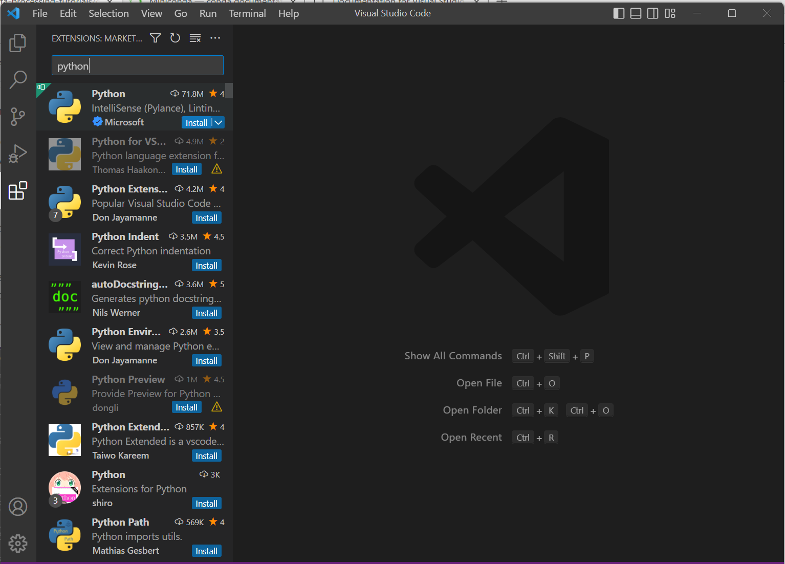
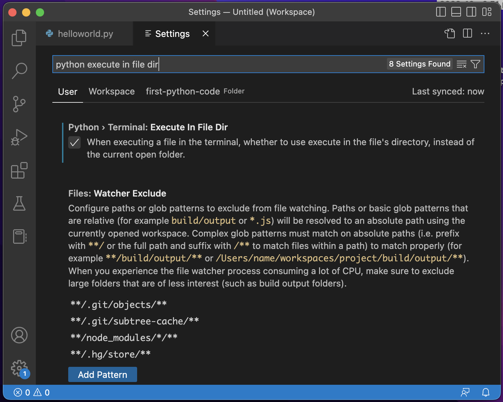

# Basic data processing tutorials Day 1: Install the basic stuffs

Here I show you a minimal set of tools we're going to need in this series of tutorials. Let's get started!

## 1. Install conda

First, we're going to install Python because that's the main language used in this tutorial series. 
But we don't install Python directly. Instead, we use a program called conda and use conda to create a *virtual* Python environment. 

conda is originally a package manager for a Python distribution called Anaconda, which contains a big set of Python packages and some tools out of the box. But due to the usefulness of conda, there is now Miniconda distribution that contains (mostly) only conda. I recommend Miniconda because we don't use most of the things that come with Anaconda anyway. 

To install, simply go to the [Miniconda web page](https://docs.conda.io/en/latest/miniconda.html), download the latest installer, and run it. 

## 2. Create a virtual enviroment with conda

Use of conda is slightly different among the platforms. 

### On Windows
Once conda is installed, you will find Anaconda Prompt in your installed apps. 
The conda command is available only in Anaconda Prompt (not in the default Command Prompt). 

Launch Anaconda Prompt. You will see something like

    (base) C:\Users\[your user name]>

The `(base)` at the beginning tells you that you are in `base` environment. This is the default environment in conda. 

**Caution:** Any modification to `base` environment is usually not recommended. Do not install any packages to `base`.

To create your own brand-new environment, type the following

    conda create -n my_first_env python=3.10

and run it by Enter key. 
A new environment will be created with the Python version of 3.10 (which was the latest version when I wrote this section). 
You will be asked if it's OK to proceed. Type y and press Enter to proceed. 

To do something in your new `my_first_env`, you have to enter that environment. Run the following: 

    conda activate my_first_env

Now the Anaconda Prompt should be showing something like

    (my_first_env) C:\Users\[your user name]>

which indicates that you are now in `my_first_env` environment. 

### On Mac

There is no Anaconda Prompt in Mac. The default Terminal has been modified. Open Terminal and you will see something like

    (base) [username]@[hostname] ~ %

which indicates that you are in the `base` environment. 
Otherwise it's the same as Windows. 
Follow the instruction in the previous section. 

## 3. Install Visual Studio Code

Although you can write your Python code in Notepad and run it from the command prompt, it's definitely better to use a good editor. 

Long story short, [Visual Studio Code](https://code.visualstudio.com/) (VSCode for short) is the best free editor for programming today (in my opinion). Go to the website, download the installer, and install it.  

Next, run VSCode and go to Extensions tab. Search for Python extension and install it. 

### An important setting in VSCode

By default, when you run a Python code from VSCode, it will be executed at the current directory of the terminal. This may be different from the code file's location. 

To ensure that the Python code runs in that code file's folder, go to File > Preferences > Settings in the menubar (or Code > Preferences > Settings in Mac). 

In the Settings, type `python execute in file dir` in the search box. Turn on the option appeared. 
The option may not appear right after you install Python extension. 
In that case, restart the VSCode. 

 

### Additional setting on Windows

The integrated terminal in VSCode is set to PowerShell by default. 
To use conda in the integrated terminal in VSCode, 

1. Press `Ctrl`+`Shift`+`P` to open Command Palette
2. Enter `select default profile`. 
3. Select the command `Terminal: Select Default Profile`
4. Select `Command Prompt` and hit Enter. 

## 4. Install Git

Git is a popular version control software. You may not use it 