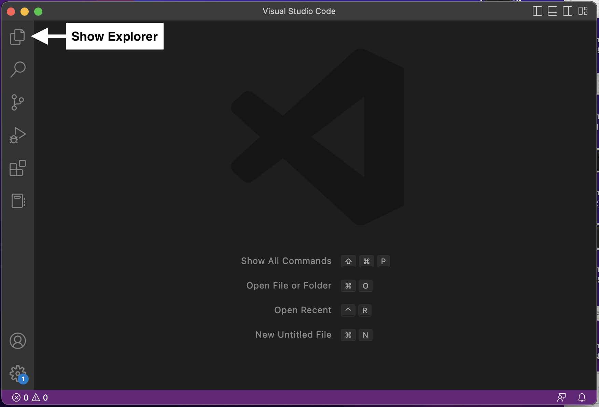
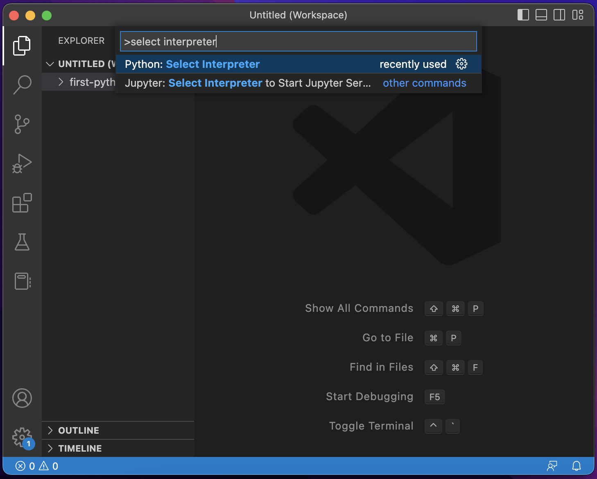
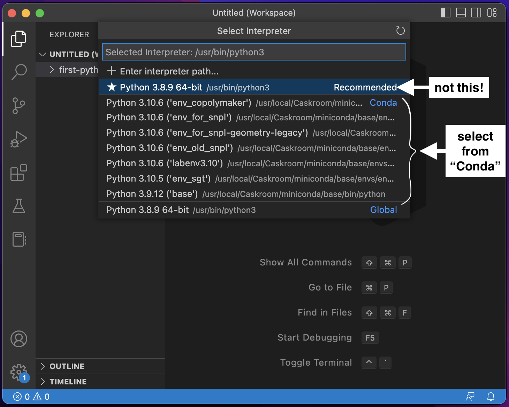
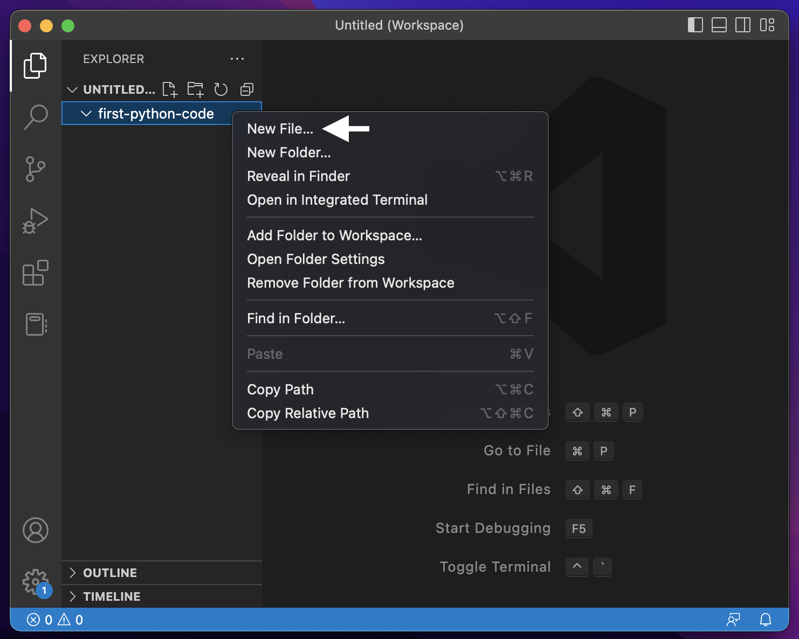
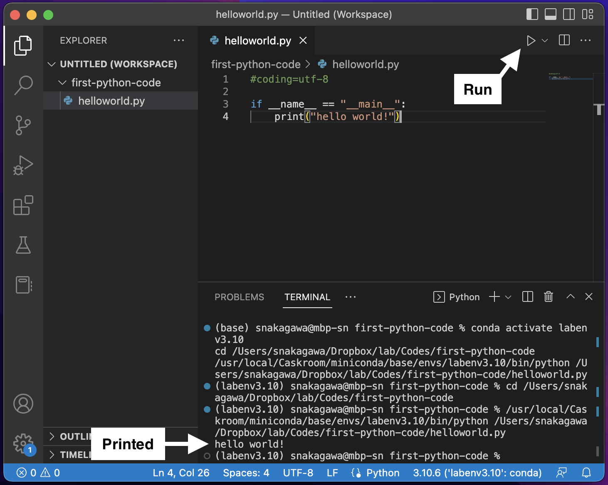

# Basic data processing tutorials Day 2: Write your first Python code

## 1. Choose or create a folder
First, let's decide where to put the codes you will write. Create folders if necessary. 

### Windows example

    C:\Users\[your user name]\lab\Codes\first-python-code

### macOS example

    /Users/[your user name]/lab/Codes/first-python-code

In my case, I have a folder dedicated to studies in my Dropbox folder. So it's like

    /Users/[my user name]/Dropbox/lab/Codes/first-python-code

## 2. Add the folder to the VSCode workspace
VSCode has a feature called *workspace*. It's like a virtual folder, into which real folders can be added. The added folders can be accessed in the Explorer side bar. 

In the menu bar, File -> Add Folder to Workspace... then select your folder. 

To view the workspace, show the Explorer side bar. 



## 3. Select interpreter
Normally you have multiple Python installs in your PC. At least you have two, one in `base` environment and one in `my_first_env` that you have created in [Day 1](day1.md). You have to tell the VSCode which one you want to use to run your code. 

In the VSCode, press down `Ctrl` + `Shift` + `P` (on Mac, `Command` + `Shift` + `P`). You will see a text box near the top of the window. This is Command Palette, which is used to cofigure many things in VSCode. Type `select interpreter`, then you will see some candidates. 



Select `Python: Select Interpreter`. Then it shows a list of folders you have in the current workspace. Select `first-python-code`. Now you see something like below: 



Since this is the situation in my PC right now, there are many environments. You will see much fewer options. Click or Enter at `my_first_env`. 

Now, VSCode can run your code in the `first-python-code` using Python in `my_first_env`. 

## Write and run the code

In the Explorer side bar, right click on the folder -> New File to create a new file. Name it as, for example, `helloworld.py`. 



Open the file. Paste the following code and save. 

```python
#coding=utf-8

if __name__ == "__main__":
    print("hello world!")
```
Click the little play button at the upper right corner. The code will run and you will see the output in the console at the bottom. 



Congratulations! You have ran your first ever Python code. 